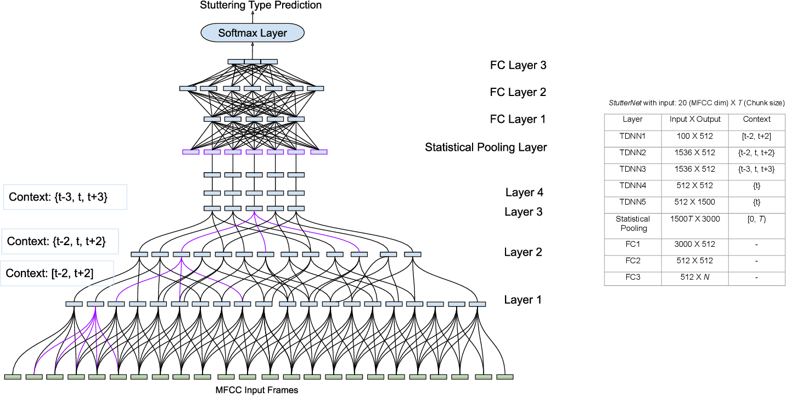

# EC523-Final-Project



For our final project in EC523 we chose to solve the stutter detection task
posed by Apple's SEP-28k dataset. In an attempt to solve this task, we tried three different neural network architectures: StutterNet proposed by
Sheikh et al., a variation of the Transformer proposed by Vaswani et al. with 1D convolutional layers replacing linear output layers, and a 1D variant of ResNet proposed by He et al.

We implemented our experiments in Pytorch and used Sklearn, Tensorboard, and Ray for evaluation and training.

We provide a tutorial in our [Jupyter Notebook](./tutorial.ipynb). The [StutterNet](./StutterNet) directory contains the tools used in these experiments.

List of python packages contained in [requirements.txt](./requirements.txt)

Below is short explanation of remaining files in the project folder.

```
├── requirements.txt
├── tutorial.ipynb
├── StutterNet
├── classes.txt
├── fetch.sh
│   ├── io.py
│   ├── losses.py
│   ├── metrics.py
│   ├── models.py
│   ├── train.py
│   ├── __init__.py
└── README.md                  This is the file you are currently reading
```

[io.py](StutterNet/io.py) contains the tools for creating the Pytorch data
pipeline.

[losses.py](StutterNet/losses.py) contains the loss functions used for training and evaluation.

[metrics.py](StutterNet/metrics.py) contains the metrics used for evaluation.

[models.py](StutterNet/models.py) contains the model definitions for our experiments.

[train.py](StutterNet/train.py) contains the training/evaluation function.

**Getting Started**:

*Test on Ubuntu 18.04 LTS*

1. Clone the Repository:
   
   git clone https://github.com/chmo2019/EC523-Final-Project/

2. Navigate to the repository:

   cd EC523-Final-Project

3. Fetch the dataset:

   chmod +x fetch.sh
   ./fetch.sh
 

